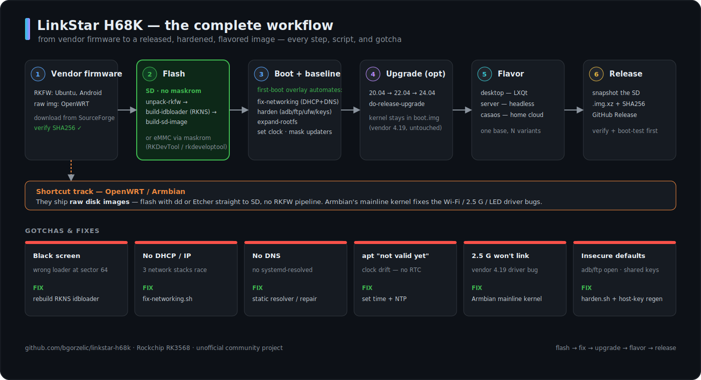

# LinkStar H68K Documentation

[← Home](../README.md) › Docs

The complete guide to the Seeed Studio LinkStar H68K (RK3568). Everything here was
either verified on real hardware or is clearly marked as unverified.

  

## Pick your path

| I want to… | Go to |
|------------|-------|
| Flash Ubuntu the easy way | [Flash from a Mac](flash-ubuntu-sd-from-mac.md) |
| Install to eMMC / use Windows | [eMMC over USB](flash-emmc-windows.md) |
| Run OpenWRT, Armbian, or another Linux | [Other operating systems](alternative-os.md) |
| Set up a desktop / server / home cloud | [Flavors](../flavors/README.md) · [CasaOS](casaos.md) |
| Secure a running unit | [Hardening](hardening.md) |
| Fix networking / DNS / no-IP | [Networking](networking.md) · [Known issues](known-issues.md) |
| Upgrade Ubuntu to the latest | [Upgrading](upgrading.md) |
| Understand the boot process | [How it works](how-it-works.md) |
| Run it as a NAS / web-managed box | [Appliance: Cockpit + Samba + firewall](appliance-cockpit-nas-firewall.md) |
| Speed up boot / de-bloat | [Boot optimization](boot-optimization.md) |
| Recover an unbootable card (from a Mac) | [Offline SD repair](offline-sd-repair-debugfs.md) |
| Build & publish a release | [Releasing](releasing.md) |

## Start here

- **[Flash Ubuntu to an SD from a Mac](flash-ubuntu-sd-from-mac.md)** — the
  recommended way to (re)install: no maskrom, no Windows. ⭐
- **[Flashing & recovery overview](flashing-and-recovery.md)** — all the paths,
  including maskrom/eMMC recovery when SD boot isn't enough.
- **[Flash to eMMC over USB (Windows & Linux/macOS)](flash-emmc-windows.md)** — the
  thorough maskrom/RKDevTool guide for permanent internal installs & factory restore.
- **[Running other operating systems](alternative-os.md)** — OpenWRT, Armbian, Debian,
  Android; the simpler raw-image route (and the real fix for the vendor driver bugs).

## Reference

- **[Hardware](hardware.md)** — SoC, RAM, NICs, LEDs, ports, with real photos + infographic.
- **[How SD boot works (RK3568 internals)](how-it-works.md)** — boot chain, the
  RKFW/RKAF container format, the idbloader black-screen fix, networking.
- **[Known issues & fixes](known-issues.md)** — the release driver bugs + the stock
  image's insecure defaults, with remediations.
- **[First boot](first-boot.md)** — default credentials and what the stock image does
  on first boot (+ the fast path).
- **[Hardening](hardening.md)** — locking the box down (companion to `scripts/harden.sh`).
- **[Networking](networking.md)** — the four ports + chipsets, the /22 discovery quirk,
  DHCP/static config, and router port mapping.
- **[Storage](storage.md)** — eMMC vs microSD boot, expanding the rootfs, SD backups.
- **[Appliance: web + NAS + firewall](appliance-cockpit-nas-firewall.md)** — Cockpit console,
  Samba NAS, and a `ufw` setup with a lockout-proof rollback timer.
- **[Boot optimization](boot-optimization.md)** — de-bloat to a ~9 s boot with an SSH-only surface.
- **[Offline SD repair (debugfs)](offline-sd-repair-debugfs.md)** — diagnose/fix an unbootable
  rootfs from a Mac, no Linux box needed.
- **[USB serial console](serial-console.md)** — see *why* it won't boot: wiring + macOS/Windows/Linux
  setup at 1500000 baud, and how to capture a boot log.
- **[OS images](os-images/)** — image matrix + the archived vendor release note.
- **[Firmware downloads & checksums](../firmware/README.md)**

## Building & releasing

- **[Releasing (reproducible builds)](releasing.md)** — the pinned, one-command
  release process, the track/flavor matrix, versioning, and how to add new tracks.
- **[Upgrading Ubuntu in place](upgrading.md)** — 20.04 → 22.04 → 24.04 safely: the
  distro-upgrade path, the gotchas, and rollback.
- **[Flavors & the release matrix](../flavors/README.md)** — desktop / server / casaos
  variants and how a flavored image is built.
- **[CasaOS flavor](casaos.md)** — the home-server / personal-cloud web UI: install, first
  boot, and firewall.
- **[OpenWRT build brief](openwrt-superprompt.md)** — the v0.2.0 spec for a GL.iNet-class
  OpenWRT firmware (the path to a full Wi-Fi router / AP).
- **[SpookyWrt quickstart](spookywrt-quickstart.md)** — build → flash → onboard, the H68K
  port map, and the live-flash gotchas.
- **[Wireless support](wireless-support.md)** — injection/monitor chipset matrix, the 6 GHz
  reality, and which USB adapters actually work.
- **[Packet capture & VPN/mesh](capture-and-vpn.md)** — dump traffic to Wireshark, and Tailscale /
  WireGuard / OpenVPN / ZeroTier + split-tunnel (PBR) setup.
- **[VPN providers](vpn-providers.md)** — import Mullvad/Proton/Nord/PIA/etc. (WireGuard or OpenVPN)
  with a kill-switch, via `spooky-vpn`.

Contributions welcome — see [`../CONTRIBUTING.md`](../CONTRIBUTING.md).
