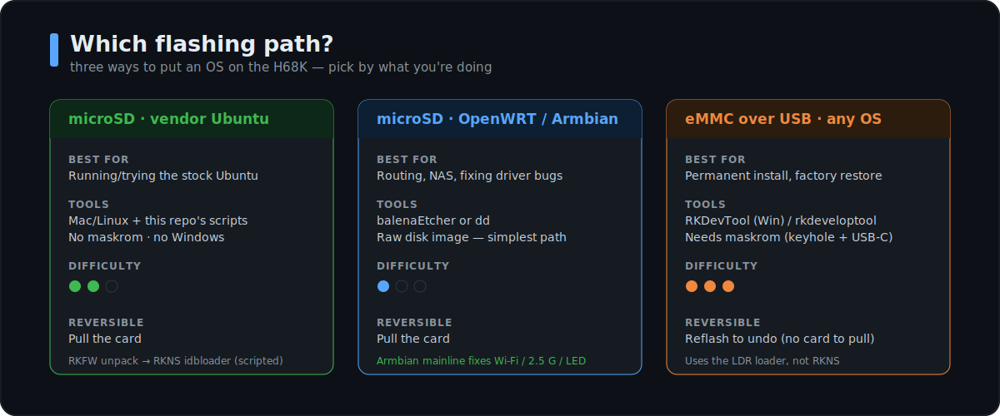

# Running other operating systems

<sub>[Home](../README.md) › [Docs](README.md) › Other OSes</sub>

The H68K is not locked to the vendor Ubuntu. It's a mainstream RK3568 board, so it
runs **OpenWRT, Armbian, Debian, and Android** too. There are two families of images,
and they flash very differently:

- **RKFW vendor images** (Ubuntu, Android) — a container, not a disk image. Use this
  repo's [SD pipeline](flash-ubuntu-sd-from-mac.md) or [RKDevTool](flash-emmc-windows.md).
- **Raw disk images** (OpenWRT, Armbian, Debian) — a real disk image. Flash it directly
  with `dd` or balenaEtcher. **This is the simplest path** — no unpack, no idbloader rebuild.

<p align="center">
  
</p>

## OS matrix

| OS | Image type | How to flash | Drivers (Wi-Fi / 2.5 G / LED) | Best for |
|----|-----------|--------------|-------------------------------|----------|
| **Ubuntu 20.04** (vendor) | RKFW | [SD pipeline](flash-ubuntu-sd-from-mac.md) / RKDevTool | vendor bugs | LXQt desktop |
| **OpenWRT** (vendor + community) | raw `.img` | `dd`/Etcher to SD, or eMMC | 2.5 G works in current builds | router / firewall |
| **Armbian** (amazingfate / ophub) | raw `.img` | `dd`/Etcher | **mainline — fixes all three** | server / NAS, best drivers |
| **Debian** (Armbian-based / community) | raw `.img` | `dd`/Etcher | mainline | minimal server |
| **Android 11** (vendor) | RKFW | RKDevTool → eMMC | vendor | media / TV box |

> [!TIP]
> If the vendor Ubuntu's **Wi-Fi / 2.5 G / front-LED bugs** bother you, the real fix is
> a community **Armbian** build with a mainline kernel — see [known-issues.md](known-issues.md).

## Armbian — the route to working drivers

Community Armbian images target `rk3568-opc-h68k` and ship a modern kernel, so the
`mt7921e` Wi-Fi, `r8125` 2.5 G, and GPIO LED all work.

- **Where:** [amazingfate/armbian-h68k-images](https://github.com/amazingfate/armbian-h68k-images)
  and [ophub/amlogic-s9xxx-armbian](https://github.com/ophub/amlogic-s9xxx-armbian).
- **Flash:** raw `.img.xz` → SD with Etcher (or `dd`). Boot from SD.
- **First boot:** Armbian's usual flow — log in as `root` / `1234`, then it forces a
  password change and creates your user. Use `armbian-config` for tuning.
- **Caveat:** on *some* ophub kernels the 1 G ports (RTL8211F) can fail
  (`phy_poll_reset … -110`) — test all four ports after flashing. See
  [known-issues.md](known-issues.md).

## OpenWRT — router / firewall

- **Where:** the vendor image on [SourceForge](https://sourceforge.net/projects/linkstar-h68k-os/files/Openwrt/)
  (`openwrt-rockchip-R22.11.18_opc-h68k-d-…-sysupgrade.img`) plus community builds.
- **Flash:** it's a raw sysupgrade image — `dd`/Etcher to SD, or flash to eMMC via RKDevTool.
- **Access:** LuCI web UI; default mapping `eth0` = WAN, the rest LAN; login `root` / `password`.

## Android — media / TV box (and the Wi-Fi reality)

The vendor ships **Android 11** (R22.11.17), flashed to **eMMC** via RKDevTool — see
[flash-emmc-windows.md](flash-emmc-windows.md). Good for an HDMI media-player / TV box.

**Internal Wi-Fi does not work on it.** Vendor Android 11 runs the **4.19 vendor kernel**,
which has no MT7921 driver (`mt7921e` landed upstream in kernel 5.12) — the same wall as the
vendor Ubuntu (see [known-issues.md](known-issues.md), "Wi-Fi & Access Point").

**"What's the latest Android with working internal Wi-Fi?"** — the most-asked question here's
the honest answer:

- RK3568 as a chip supports up to **Android 14** (Rockchip's Android 13/14 SDKs use kernel
  5.10, which *can* carry a back-ported MT7921 driver).
- But there is **no published, turnkey H68K Android image with confirmed internal Wi-Fi.**
  Getting it means **building Android 13/14 from the Rockchip RK3568 SDK** with the MT7921
  driver enabled and the H68K device tree — real work, and unverified on this exact board.
- **If you want Wi-Fi + everything working, don't pick Android — pick OpenWRT (router/AP) or
  Armbian (general Linux).** Both ship a kernel new enough for the MT7921 driver. Internal
  Wi-Fi is a *kernel-version* limit, not something the OS userland can fix.

## More options (community RK3568 builds)

Almost anything with an RK3568 target runs on the H68K — and most of these inherit a
**mainline kernel**, so Wi-Fi (MT7921) and the 2.5 G ports actually work, unlike the vendor
4.19 images. Notable picks by use case:

| Goal | OS | Notes |
|------|----|-------|
| **Media center** | **LibreELEC** (Kodi) | RK3568 in LE13 testing (chewitt's Rockchip images). Ideal for the HDMI media box. |
| **Retro gaming** | **Batocera** (or Lakka / EmuELEC) | RK3568 supported (Anbernic RG-class, Odroid M1); Kodi included. |
| **NAS** | **OpenMediaVault** | Full NAS web UI on a Debian/Armbian base — heavier-duty alternative to CasaOS. |
| **Minimal server** | **DietPi** | Lightweight Debian, tiny footprint; installs on an Armbian base. |
| **Home automation** | **Home Assistant** | Supervised on Armbian, or HAOS generic-aarch64. |
| **Router (best HW support)** | **ImmortalWrt** | OpenWRT fork with `kmod-r8125` (2.5 G) + MT7921 Wi-Fi — often smoother here than stock OpenWRT. |
| **Arch / rolling** | **Manjaro ARM** | Boots, but display issues have been reported on RK3568 — test HDMI. |
| **Custom / minimal** | **Buildroot / Yocto** | Vendor-supported; for appliances you build yourself. |

Most ship as **raw disk images** — `dd`/Etcher to SD (below). Sourcing:
[ophub](https://github.com/ophub/amlogic-s9xxx-openwrt) and
[amazingfate](https://github.com/amazingfate/armbian-h68k-images) target `rk3568-opc-h68k`;
[LibreELEC](https://forum.libreelec.tv/thread/29953) and Batocera publish their own RK3568 images.

> [!NOTE]
> **Wi-Fi and 2.5 G work on these only if the build uses a kernel ≥ 5.12** (mainline) — the norm
> for LibreELEC / Batocera / Armbian-based images, and the opposite of the vendor 4.19 track.

## How to flash a raw image (the simple path)

```bash
# macOS  (rdiskN is much faster than diskN)
diskutil list
diskutil unmountDisk /dev/diskN
xz -dc image.img.xz | sudo dd of=/dev/rdiskN bs=4m
sync

# Linux
lsblk
xzcat image.img.xz | sudo dd of=/dev/sdX bs=4M status=progress
sync
```

Or use **[balenaEtcher](https://etcher.balena.io/)** — cross-platform, handles
compressed images, and won't let you pick the wrong disk. Grow the rootfs on first
boot if the image doesn't ([`expand-rootfs.sh`](../scripts/expand-rootfs.sh)).

## SD vs eMMC

Try things from **microSD** (pull it to revert); commit a favorite to **eMMC** for a
card-free permanent install. See [flashing-and-recovery.md](flashing-and-recovery.md).

## Credit

Armbian for the H68K is community work — thanks to the maintainers listed in
[`../CREDITS.md`](../CREDITS.md).
