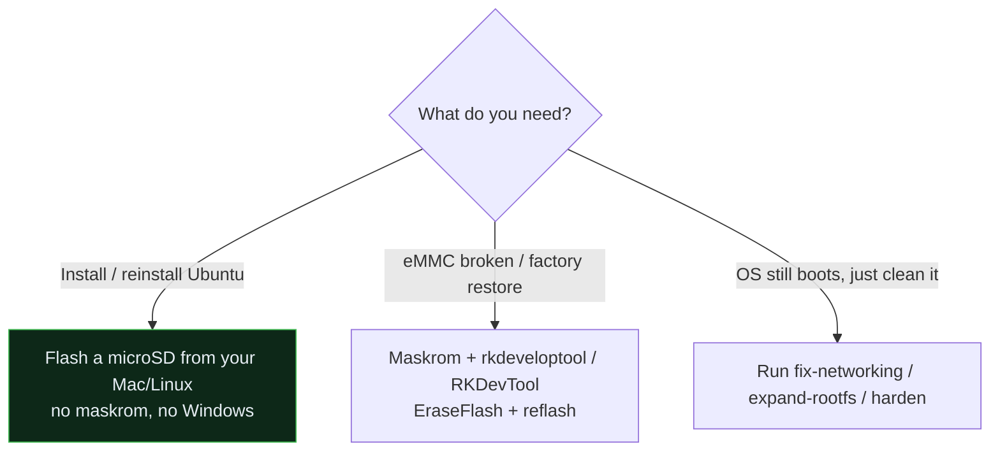

# Flashing & Recovery

The LinkStar H68K can run from **microSD** or from its **onboard eMMC**. There are
three situations you might be in — pick the matching path.



## 1. Install / reinstall Ubuntu → boot from microSD ⭐ (recommended)

**No maskrom, no Windows.** The RK3568 bootROM checks the SD (TF) slot before eMMC,
so you can lay a bootable Ubuntu onto an SD card from a Mac or Linux box and just
boot it. The onboard eMMC is left untouched — pull the SD to fall back to it.

→ Full walkthrough: **[flash-ubuntu-sd-from-mac.md](flash-ubuntu-sd-from-mac.md)**
→ Why it works (RKFW container, the `RKNS` idbloader fix): **[how-it-works.md](how-it-works.md)**

This is the path most people want. It's non-destructive to the factory eMMC image
and recoverable (just remove the card).

## 2. Recover / reflash the eMMC → maskrom + Rockchip tools (fallback)

Use this when the eMMC image itself is broken, you want to restore the factory
state, or you're deliberately reflashing internal storage.

You'll need:

- The **EraseFlash** image and the **bootloader** (`H68K-Boot-Loader_*.bin`) — see
  [`../firmware/README.md`](../firmware/README.md) for downloads + checksums.
- The **USB-C** port on the H68K connected to your computer (use USB-C, *not* a
  Type-A port).
- **RKDevTool v2.84** + **Rockchip DriverAssistant v5.1.1** (Windows — the documented
  vendor path), or **`rkdeveloptool`** (Linux/macOS — build notes in
  [how-it-works.md](how-it-works.md#building-the-tools)).

### Enter maskrom mode

Hold the recessed **"Update keyhole"** button with a SIM-eject pin, connect the
**USB-C** cable to your PC while still holding, then release. The tool should report
**"Found One MASKROM Device."**

### Windows (RKDevTool) — documented vendor path

1. Install the driver with `DriverInstall.exe` (Rockchip DriverAssistant).
2. Open `RKDevTool.exe`; enter maskrom mode (above).
3. If the eMMC is in a bad state, click **EraseFlash** first (wipes eMMC via
   `LinkStar-H68K-EraseFlash.img`).
4. Set **Boot** = `H68K-Boot-Loader_*.bin`, **System** = your target `.img`
   (Ubuntu / OpenWRT / Android).
5. Click **Run** → wait for **"Download image OK."**

### Linux / macOS (rkdeveloptool)

> [!NOTE]
> Seeed documents only the Windows GUI. The commands below are the **standard RK3568
> maskrom pattern** (community-verified, not H68K-specific docs) — treat exact args
> as unverified.

```bash
rkdeveloptool ld                          # confirm Maskrom/Loader mode
rkdeveloptool db  H68K-Boot-Loader_*.bin  # load the bootloader into SRAM
rkdeveloptool ef                          # (optional) erase flash
rkdeveloptool wl 0 <system>.img           # write the OS image
rkdeveloptool rd                          # reboot
```

<!-- -->

> [!IMPORTANT]
> For **eMMC** flashing the loader is `MiniLoaderAll.bin` in its native `LDR ` format.
> That is the opposite of the SD path, where sector 64 needs the rebuilt **`RKNS`**
> idbloader. Don't mix them up — using the wrong one is the classic black-screen bug.

## 3. Reset a running unit to a clean baseline (no reflash)

If the OS still boots and you just want it clean and secure rather than reflashed,
you don't need any of the above — run the setup/hardening scripts:

```bash
sudo scripts/fix-networking.sh     # single, sane network stack
sudo scripts/expand-rootfs.sh      # use the whole card
sudo scripts/harden.sh --pubkey-file ~/.ssh/authorized_keys
sudo scripts/first-setup.sh --hostname h68k-01 --update
```

## Which loader goes where — quick reference

| Target | Loader at sector 64 | Format | Built by |
| -------- | -------------------- | -------- | ---------- |
| **microSD boot** | rebuilt idbloader | **`RKNS`** (rksd) | `scripts/build-idbloader.sh` |
| **eMMC via maskrom** | `MiniLoaderAll.bin` | **`LDR `** (download) | vendor / RKFW |
