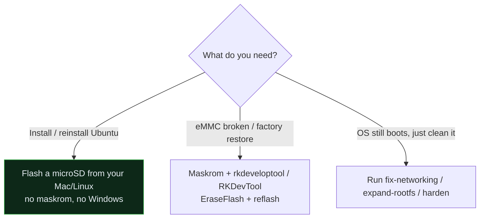

# Flashing & Recovery

The LinkStar H68K can run from **microSD** or from its **onboard eMMC**. There are
three situations you might be in — pick the matching path.



## 1. Install / reinstall Ubuntu → boot from microSD ⭐ (recommended)

**No maskrom, no Windows.** The RK3568 bootROM checks the SD (TF) slot before eMMC,
so you can lay a bootable Ubuntu onto an SD card from a Mac or Linux box and just
boot it. The onboard eMMC is left untouched — pull the SD to fall back to it.

→ Full walkthrough: **[flash-ubuntu-sd-from-mac.md](flash-ubuntu-sd-from-mac.md)**
→ Why it works (RKFW container, the `RKNS` idbloader fix): **[how-it-works.md](how-it-works.md)**

This is the path most people want. It's non-destructive to the factory eMMC image
and recoverable (just remove the card).

## 2. Recover / reflash the eMMC → maskrom + Rockchip tools (fallback)

Use this when the eMMC image itself is broken, you want to restore the factory
state, or you're deliberately reflashing internal storage.

You'll need:

- The **EraseFlash** image and the **bootloader** (`H68K-Boot-Loader_*.bin`) — see
  [`../firmware/README.md`](../firmware/README.md) for downloads + checksums.
- A USB-A↔USB-C (or the vendor-specified) cable between the board and your computer.
- One of:
  - **RKDevTool** (Windows) — the vendor GUI flasher, or
  - **`rkdeveloptool`** (Linux/macOS) — the CLI equivalent. Building it natively on
    macOS is covered in [how-it-works.md](how-it-works.md#building-the-tools).

Outline of the CLI flow (`rkdeveloptool`, device in maskrom/loader mode):

```bash
rkdeveloptool ld                       # confirm the device is in Maskrom/Loader mode
rkdeveloptool db  MiniLoaderAll.bin     # push the download-mode loader (the LDR-format one)
rkdeveloptool ef                        # erase flash   (or write LinkStar-H68K-EraseFlash.img)
rkdeveloptool wl 0 <image>              # write image(s) at their offsets
rkdeveloptool rd                        # reboot
```

> [!NOTE]
> Entering **maskrom mode** (holding the recessed maskrom/recovery button while
> applying power, or shorting the documented test point) is board-specific. The
> exact button/procedure for the H68K is documented in
> [hardware.md](hardware.md) *(being finalized against the Seeed wiki)*. Until then,
> follow Seeed's official RKDevTool instructions for the maskrom step.

<!-- -->

> [!IMPORTANT]
> For **eMMC** flashing the loader is `MiniLoaderAll.bin` in its native `LDR ` format.
> That is the opposite of the SD path, where sector 64 needs the rebuilt **`RKNS`**
> idbloader. Don't mix them up — using the wrong one is the classic black-screen bug.

## 3. Reset a running unit to a clean baseline (no reflash)

If the OS still boots and you just want it clean and secure rather than reflashed,
you don't need any of the above — run the setup/hardening scripts:

```bash
sudo scripts/fix-networking.sh     # single, sane network stack
sudo scripts/expand-rootfs.sh      # use the whole card
sudo scripts/harden.sh --pubkey-file ~/.ssh/authorized_keys
sudo scripts/first-setup.sh --hostname h68k-01 --update
```

## Which loader goes where — quick reference

| Target | Loader at sector 64 | Format | Built by |
| -------- | -------------------- | -------- | ---------- |
| **microSD boot** | rebuilt idbloader | **`RKNS`** (rksd) | `scripts/build-idbloader.sh` |
| **eMMC via maskrom** | `MiniLoaderAll.bin` | **`LDR `** (download) | vendor / RKFW |
