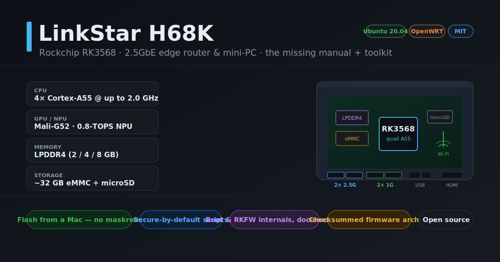
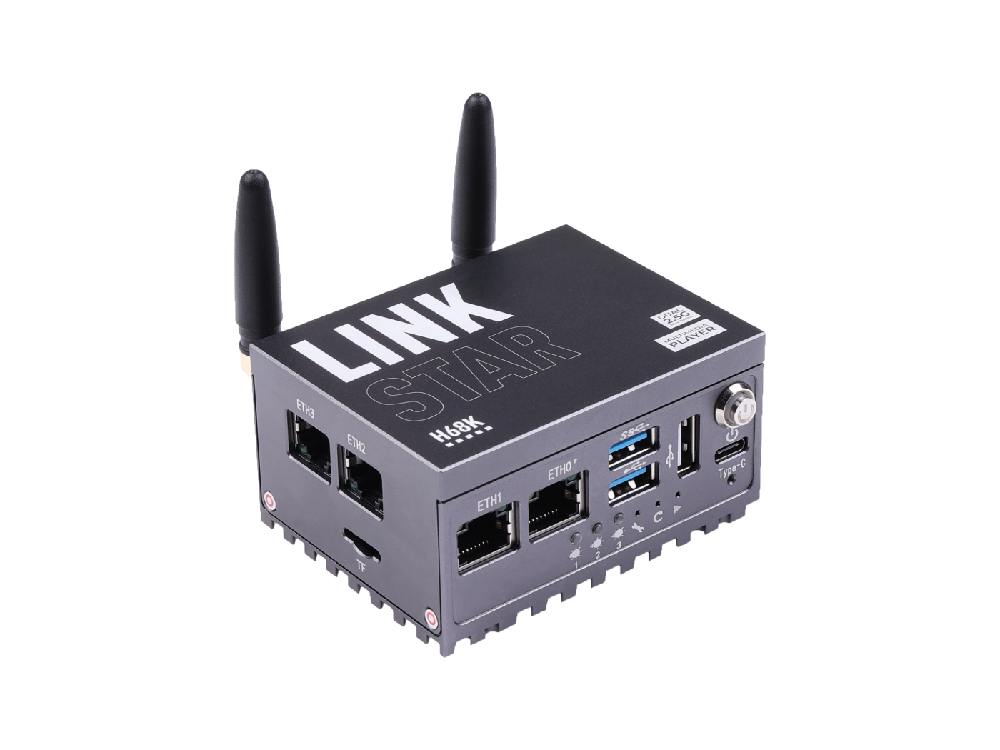
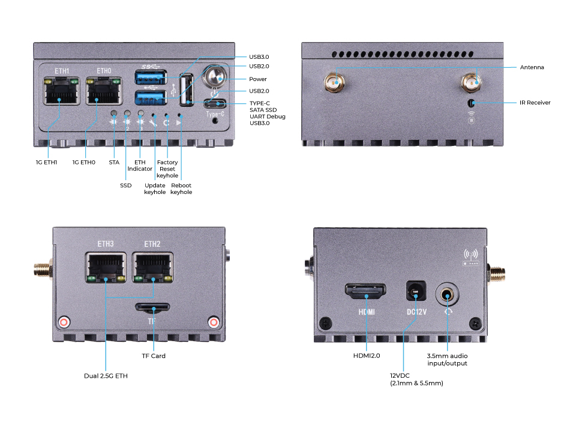
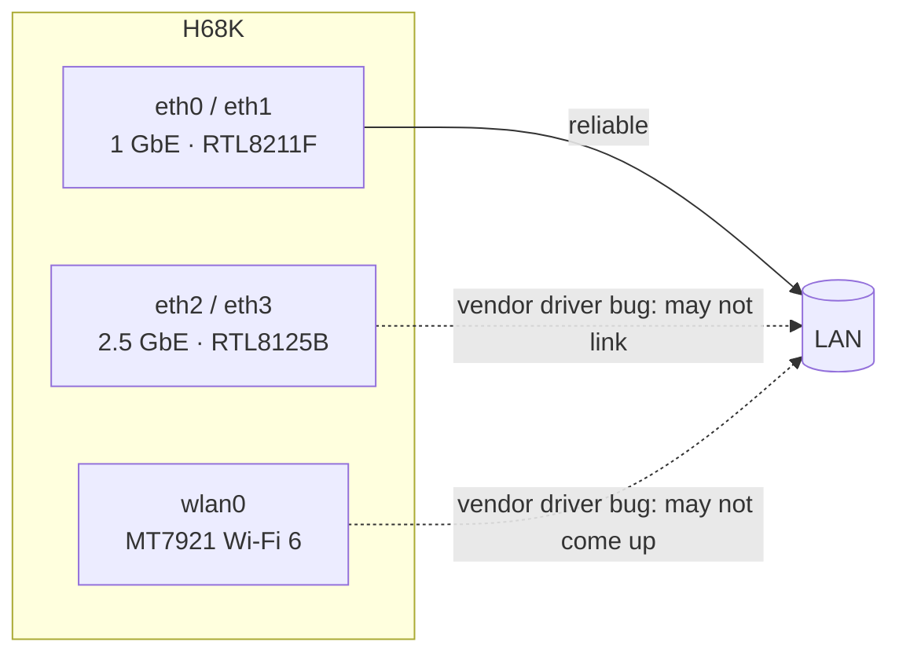
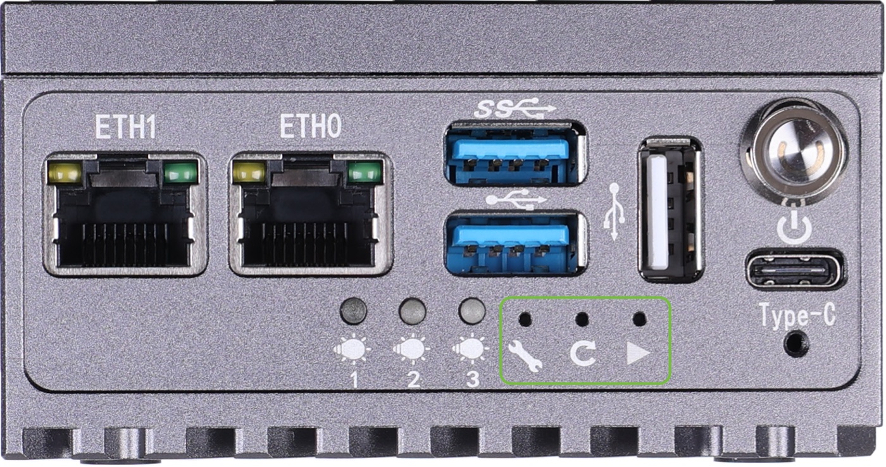
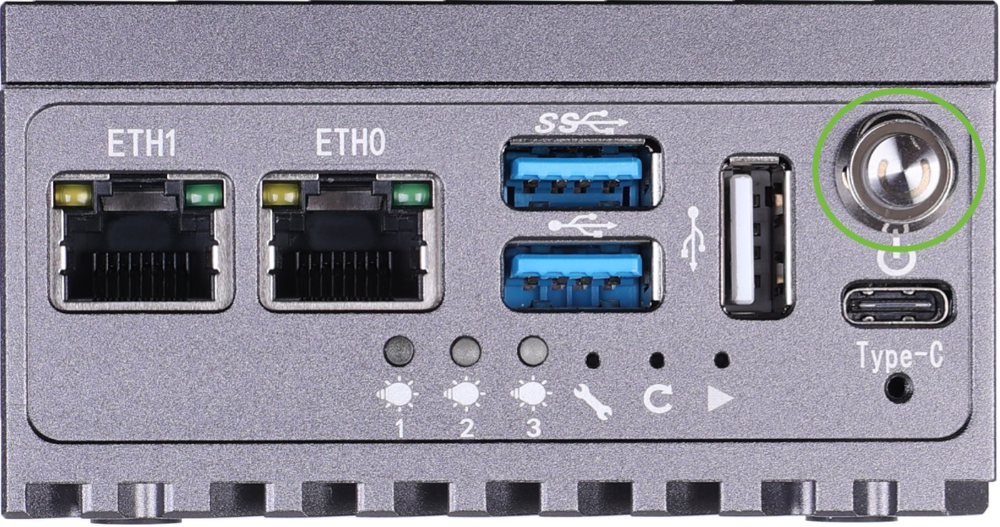

# Hardware

[Home](../README.md) › [Docs](README.md) › Hardware

  

  
  

Device photos © Seeed Studio, reused under CC BY-SA 4.0 — see [`../assets/photos/CREDITS.md`](../assets/photos/CREDITS.md).

Facts are tagged: **[VERIFIED]** = observed on a live unit in this project ·
**[OFFICIAL]** = Seeed wiki / vendor · **[COMMUNITY]** = forum / reviewer / mainline.
Sources are listed at the bottom.

> This documents the **original H68K** (2022, `opc-h68k` device tree). A later
> **H68K V2** exists with different firmware and flashing steps — noted where relevant.

## At a glance

| | | Source |
| --- | --- | --- |
| **SoC** | Rockchip RK3568, 4× Cortex-A55 @ up to 2.0 GHz | [VERIFIED] · [OFFICIAL] |
| **GPU / NPU** | Mali-G52 MP2 (2EE) · 0.8-TOPS NPU | [COMMUNITY] |
| **Video** | 4Kp60 H.265/H.264/VP9 decode; 1080p H.264/H.265 encode | [OFFICIAL] |
| **RAM** | LPDDR4X — **2 GB or 4 GB** (SKU-dependent); unit measured ~3.8 GiB (4 GB) | [VERIFIED] 4 GB · [COMMUNITY] |
| **eMMC** | 32 GB onboard (`mmcblk0` reported 29.1 GiB) | [VERIFIED] · [OFFICIAL] |
| **microSD** | TF slot (SDMMC0), bootable with priority over eMMC | [VERIFIED] · [OFFICIAL] |
| **Ethernet** | **2× 2.5 GbE (RTL8125B) + 2× 1 GbE (RTL8211F)** — four ports | [VERIFIED] · [OFFICIAL] |
| **Wi-Fi / BT** | Optional M.2 **MediaTek MT7921** (Wi-Fi 6) + BT 5.2, PCIe 2.0 | [OFFICIAL] · [COMMUNITY] |
| **Kernel (stock)** | Linux 4.19.219 aarch64 (vendor BSP) | [VERIFIED] |
| **OS (stock)** | Ubuntu 20.04.5 LTS (Lubuntu / LXQt) | [VERIFIED] · [OFFICIAL] |
| **Device-tree model** | `OWLVisionTech rk3568 opc Board` (DTB `rk3568-opc-h68k`) | [VERIFIED] · [COMMUNITY] |

### SKU decoder — `H68K-<RAM><eMMC>`

| Model | RAM | eMMC | Wi-Fi |
|-------|-----|------|-------|
| **H68K-0232** | 2 GB | 32 GB | none |
| **H68K-1432** | 4 GB | 32 GB | Wi-Fi 6 (MT7921) |

Our live unit (4 GB + MT7921 Wi-Fi) matches the **1432** class. [VERIFIED] · [OFFICIAL]

## Network interfaces

Four Ethernet ports across **two chipset families** — this is why the 2.5 G and 1 G
ports behave differently, and why only the 2.5 G pair showed up as RTL8125B:

| Interface | Port | Chipset | Speed |
|-----------|------|---------|-------|
| `eth0` / `eth1` | 1 G ×2 | Realtek **RTL8211F** (RGMII PHY off the RK3568 GMAC) | 1 GbE (~940 Mbps) |
| `eth2` / `eth3` | 2.5 G ×2 | Realtek **RTL8125B** (PCIe MAC+PHY) | 2.5 GbE (~2.35 Gbps) |
| `wlan0` | M.2 | MediaTek **MT7921** (optional) | Wi-Fi 6, up to 1200 Mbps |

The 2.5 G ports (`eth2`/`eth3`) and Wi-Fi are the ones with **vendor driver bugs** —
see [known-issues.md](known-issues.md). Default OpenWRT mapping: `eth0` = WAN, the
rest = LAN, admin UI at `192.168.100.1`. [OFFICIAL]

## I/O & physical

| Item | Value | Source |
|------|-------|--------|
| USB | 1× USB 3.0 Type-A, 2× USB 2.0 Type-A, 1× USB-C (data + 5 V power) | [OFFICIAL] · [COMMUNITY] |
| HDMI | 1× HDMI 2.0/2.1, up to 4Kp60 | [OFFICIAL] · [COMMUNITY] |
| Audio | 3.5 mm combo in/out | [OFFICIAL] |
| IR | IR receiver (IRM-3638) | [OFFICIAL] |
| Maskrom button | 1× recessed "Update keyhole" — press with a SIM-pin to enter maskrom | [OFFICIAL] |
| Power in | 5–24 V DC barrel (12 V/1 A recommended) **or** 5 V via USB-C | [OFFICIAL] · [COMMUNITY] |
| Power draw | ~8 W typical | [COMMUNITY] |
| Dimensions | 80 × 60 × 40 mm, fanless metal chassis | [COMMUNITY] |
| Operating temp | −10 °C to 55 °C | [COMMUNITY] |

No documented GPIO/expansion header is exposed. [UNCERTAIN]

## Front panel & power

  
  

The front-panel **LEDs** are the component with a known driver bug in the stock
image — see [known-issues.md](known-issues.md).

Photos © Seeed Studio, CC BY-SA 4.0 — [credits](../assets/photos/CREDITS.md).

## Storage & boot order

Two independent devices — the RK3568 bootROM checks the **microSD first**, then eMMC:

| Device | Node | Size | Contents |
|--------|------|------|----------|
| microSD | `mmcblk1` | card-dependent | Ubuntu (when you flash the SD) — root at `mmcblk1p8` |
| eMMC | `mmcblk0` | ~32 GB | factory Android-lineage vendor partitions |

Pull the SD to fall back to whatever is on eMMC. Details:
[how-it-works.md](how-it-works.md) · [flashing-and-recovery.md](flashing-and-recovery.md).

## Variants & lineage

- **`OWLVisionTech`/`opc` = a rebadge of the HINLINK OPC-H68K.** The vendor device
  tree (`rk3568-opc-h68k.dtb`, model `OWLVisionTech rk3568 opc Board`) reflects the
  OPC-H68K ODM origin. The OpenWRT build target `opc-h68k-d` implies an **H68K-D**
  revision string. [COMMUNITY]
- **Mainline Linux** carries a retail-branded port: `seeed,rk3568-linkstar-h68k-1432v1`
  (`rk3568-linkstar-h68k-1432v1.dtb`); the patch author notes the HINLINK H68K is
  "same or very similar under a different trade name." [COMMUNITY]
- **Siblings:** HINLINK **H66K** (lower-tier RK3568), the **H68K V2** (2023+ refresh),
  and config options (2/4 GB RAM, Gigabit-only, AP6256 Wi-Fi 5 vs MT7921 Wi-Fi 6). [COMMUNITY]

## Sources

- Seeed wiki — LinkStar datasheet & install: <https://wiki.seeedstudio.com/Linkstar_Datasheet/>,
  <https://wiki.seeedstudio.com/linkstar-install-system/>
- CNX Software review (specs): <https://www.cnx-software.com/2022/11/19/linkstar-h68k-rockchip-rk3568-multimedia-router-with-dual-2-5gbe-dual-gigabit-ethernet/>
- Firmware host — SourceForge `linkstar-h68k-os`: <https://sourceforge.net/projects/linkstar-h68k-os/files/>
- Community DTs / mainline lineage: <https://github.com/amazingfate/armbian-h68k-images>,
  <https://github.com/ophub/amlogic-s9xxx-armbian/issues/1726>

> [!NOTE]
> A few details still conflict across sources (HDMI 2.0 vs 2.1; USB-C data 3.0 vs 2.0)
> and the literal DT `model=` capitalization isn't byte-confirmed. Own an H68K and can
> settle one? Please file a [hardware report](../CONTRIBUTING.md).
