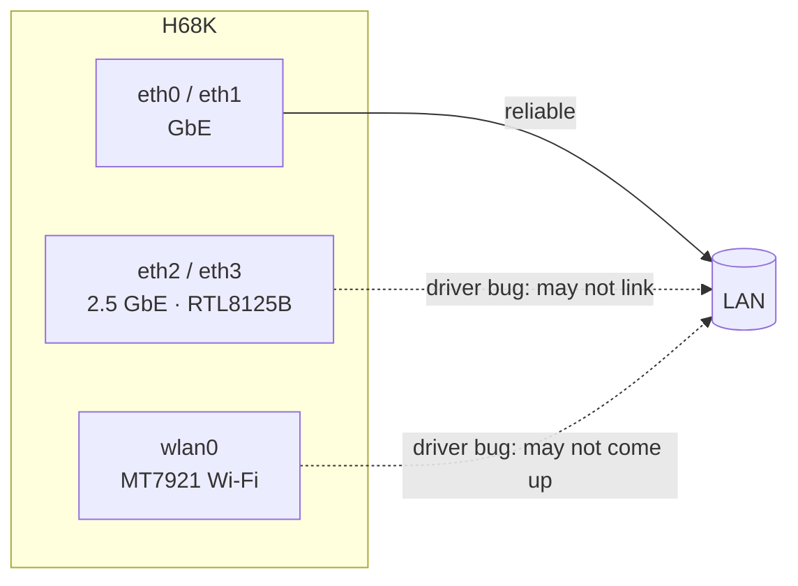

# Hardware

  

Facts are tagged: **[VERIFIED]** = observed on a live unit in this project ·
**[SPEC]** = RK3568 platform spec, being confirmed against the Seeed wiki ·
**[VENDOR]** = from the official release note.

## At a glance

| | | Source |
|---|---|---|
| **SoC** | Rockchip RK3568, 4× Cortex-A55 (`nproc` = 4) | [VERIFIED] |
| **GPU / NPU** | Mali-G52 2EE GPU · 0.8-TOPS NPU | [SPEC] |
| **RAM** | LPDDR4/4x — unit measured ~3.8 GiB (≈4 GB); board offered in 2/4/8 GB | [VERIFIED] 4 GB · [SPEC] others |
| **eMMC** | ~32 GB (`mmcblk0` reported 29.1 GiB) | [VERIFIED] |
| **microSD** | full-size UHS microSD slot, bootable | [VERIFIED] |
| **Ethernet** | 2× 2.5 GbE (Realtek RTL8125B) + additional GbE port(s) | [VENDOR] 2.5G · [SPEC] count |
| **Wi-Fi / BT** | MediaTek MT7921 ("M7921E") | [VENDOR] |
| **Kernel (stock)** | Linux 4.19.219 aarch64 (vendor BSP) | [VERIFIED] |
| **OS (stock)** | Ubuntu 20.04.5 LTS, LXQt | [VERIFIED] |
| **Device-tree model** | `OWLVisionTech rk3568 opc Board` | [VERIFIED] |

> [!NOTE]
> Port counts, exact clocks, RAM SKUs, dimensions, power input, and the maskrom
> button location are being finalized against the official Seeed wiki. Own an H68K?
> Please confirm via a [hardware report](https://github.com/) issue — see
> [`../CONTRIBUTING.md`](../CONTRIBUTING.md).

## Network interfaces

Linux enumerates four Ethernet interfaces. The vendor release note ties the 2.5 GbE
Realtek RTL8125B ports to `eth2`/`eth3` (also the ports with the known driver bug —
see [known-issues.md](known-issues.md)).

## Storage & boot order

Two independent devices — the RK3568 bootROM checks the **microSD first**, then eMMC:

| Device | Node | Size | Contents |
|--------|------|------|----------|
| microSD | `mmcblk1` | card-dependent | Ubuntu (when you flash the SD) — root at `mmcblk1p8` |
| eMMC | `mmcblk0` | ~32 GB | factory Android-lineage vendor partitions |

Pull the SD to fall back to whatever is on eMMC. Details:
[how-it-works.md](how-it-works.md) · [flashing-and-recovery.md](flashing-and-recovery.md).
