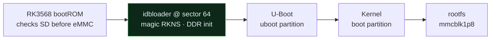

# How LinkStar H68K SD boot works (RK3568 internals)

The deep version of why the [flash guide](flash-ubuntu-sd-from-mac.md) does what
it does. Everything here was verified on a live unit, not taken from spec.

## Boot chain

The RK3568 bootROM checks microSD (TF) **before** eMMC. From sector 64 it loads
an **idbloader** (DDR init + a first-stage loader), which loads U-Boot from the
`uboot` partition, which loads the kernel from `boot`, which mounts `rootfs`.
Put a valid idbloader + the right partition layout on an SD and it boots — no
maskrom, no Windows.



The green box is the piece this project rebuilds — writing the wrong loader format
there is the black-screen bug (see below).

## The vendor image is an RKFW container

`ubuntu20.04-...-update(...).img` is not a disk image. Header magic is `RKFW`
(little-endian, packed):

| field | offset | this image |
| ------- | -------- | ----------- |
| magic | 0x00 | `RKFW` |
| chip | 0x15 | `0x33353638` → "3568" |
| loader_offset | 0x19 | 102 |
| loader_length | 0x1D | 436,672 |
| image_offset (RKAF) | 0x21 | 436,774 |
| image_length | 0x25 | 32-bit, overflowed |

At `loader_offset` sits the `LDR `-wrapped download-mode loader; at `image_offset`
sits the `RKAF` payload holding all partitions + `parameter.txt`.

### The 32-bit overflow (why afptool fails)

RKAF stores every partition `pos`/`size` as `uint32`, and the payload is ~6.6 GB,
so `rootfs`/`oem`/`userdata` offsets **wrap past 4 GB**. `afptool` reports
`Check file...Fail` (its CRC is computed over the truncated length) and rejects
the rootfs (`pos+size > length`). `unpack-rkfw.sh` reconstructs true 64-bit
offsets by chaining partitions (each real start = previous real end, bumping by
2³² until monotonic). Verified: rootfs real size = 2,757,115,904 + 2³² =
7,052,083,200; `oem` start = rootfs end; `userdata` end = payload end. Exact chain.

### Partition layout (from parameter.txt, 512-byte sectors)

| partition | start sector | image |
| ----------- | -------------- | ------- |
| uboot | 0x4000 (16384) | uboot.img |
| misc | 0x6000 (24576) | misc.img |
| boot | 0x8000 (32768) | boot.img |
| recovery | 0x18000 (98304) | recovery.img |
| backup | 0x28000 (163840) | (empty) |
| oem | 0x38000 (229376) | oem.img |
| userdata | 0x78000 (491520) | userdata.img |
| rootfs | 0x278000 (2588672) | rootfs.img — grows to fill card |

rootfs PARTUUID must be `614e0000-0000-4b53-8000-1d28000054a9` (U-Boot/kernel
find root by it). `build-sd-image.sh` sets it explicitly.

## The black-screen bug: idbloader format

`MiniLoaderAll.bin` (magic `LDR `) is the loader for **maskrom download mode**
(what RKDevTool/`rkdeveloptool db` consume). The bootROM reading sector 64 of an
SD/eMMC wants a different, `RKNS`-tagged **rksd** image. Writing the raw
`LDR `-format file to sector 64 = black screen.

`build-idbloader.sh` fixes this:

1. `rkdeveloptool unpack MiniLoaderAll.bin` → yields `FlashData` (this unit's
   exact DDR init) and `FlashBoot` (the miniloader).
2. `mkimage -n rk3568 -T rksd -d FlashData idbloader.img` then
   `cat FlashBoot >> idbloader.img`.
3. Result begins with magic `RKNS` (`52 4b 4e 53`) — what the bootROM expects.

Using the unit's own `FlashData` (not a generic DDR blob) guarantees the RAM init
matches the board.

## Networking: three stacks, one winner

The stock image enables netplan(renderer networkd) **and** NetworkManager **and**
ifupdown simultaneously; they race for eth0/eth1 and it often ends up with no
address. Fix (`fix-networking.sh`): enable systemd-networkd, **mask**
NetworkManager, netplan DHCP on eth0–eth3. After this the unit pulled DHCP
immediately. Note the LAN here is a **/22** — subnet scans must use the right CIDR,
and `nmap -Pn -p22` finds the box when ping sweeps don't.

## Building the tools

```bash
# rkdeveloptool (native). macOS: needs libusb + autotools; add
# -Wno-vla-cxx-extension -Wno-error to CXXFLAGS for clang.
git clone https://github.com/rockchip-linux/rkdeveloptool
cd rkdeveloptool && autoreconf -i && ./configure && \
  make CXXFLAGS="-g -O2 -Wno-vla-cxx-extension -Wno-error"

# rkbin provides the x86-64 mkimage used by build-idbloader.sh (run via docker
# --platform linux/amd64 on Apple Silicon).
git clone https://github.com/rockchip-linux/rkbin
```

`afptool`/`img_maker` (github/neo-technologies/rockchip-mkbootimg) are optional —
`unpack-rkfw.sh` does the extraction in pure python3 to sidestep the CRC/overflow
bug, so you don't strictly need them.

## Storage note

Booted-from-SD, root is `mmcblk1p8`; the 29 GB eMMC (`mmcblk0`, vendor Android-style
partitions) is left untouched alongside. Pull the SD to fall back to whatever is on
eMMC. The rootfs image is 6.6 GB and does **not** auto-grow — run
`resize2fs`/`expand-rootfs.sh` after first boot (verified 6.4 G → 114 G).
