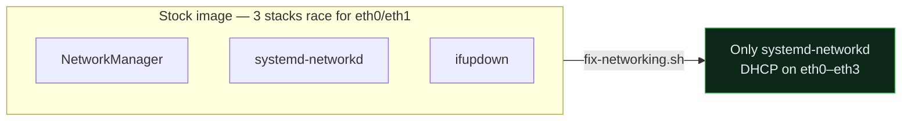

# Known Issues & Fixes

<sub>[Home](../README.md) › [Docs](README.md) › Known issues</sub>

Two categories: **driver bugs** the vendor shipped, and **insecure defaults** in the
stock Ubuntu image. Everything here was observed on real hardware or taken from the
official release note; fixes are scripted where possible.

## Vendor driver bugs (from the official release note)

The Seeed `ubuntu20.04-v0.0.1` release note (2023-02-06) lists these as known at
launch. See [os-images/ubuntu-20.04-vendor-release-note.md](os-images/ubuntu-20.04-vendor-release-note.md).

| # | Component | Symptom | Fix / status |
|---|-----------|---------|--------------|
| 1 | **MT7921 / "M7921E" Wi-Fi** | Wi-Fi may not come up | Silicon is fine — mainline `mt7921e` supports it; the vendor blob was the problem. A newer kernel fixes it. |
| 2 | **RTL8125B 2.5 GbE (`eth2`, `eth3`)** | The 2.5 G ports may not link | Works with mainline `r8125`/`r8169`; the vendor 4.19 BSP lacked a working driver. `eth0`/`eth1` (1 G) are unaffected. |
| 3 | **Front-panel LED** | LEDs not controllable | Community device trees (`rk3568-opc-h68k`) add the GPIO LED nodes the vendor image omits. |

**The reliable fix for all three: run a community image with mainline RK3568 drivers** —
e.g. [amazingfate/armbian-h68k-images](https://github.com/amazingfate/armbian-h68k-images)
or [ophub](https://github.com/ophub/amlogic-s9xxx-armbian) (both ship an
`rk3568-opc-h68k` target). A newer kernel fixes Wi-Fi, 2.5 G, and the LED at once.

> [!WARNING]
> Caveat on *some* community kernels: the 1 G ports (RTL8211F PHY) can fail with
> `phy_poll_reset failed: -110 / Cannot attach to PHY` on certain ophub Armbian
> builds (open, no posted fix). A community image can trade the 2.5 G bug for a 1 G
> one — test all four ports after switching.

## "No DHCP" out of the box

**Not a NIC fault** — the image enables **three network stacks at once** (netplan/
systemd-networkd, NetworkManager, and ifupdown). They race for `eth0`/`eth1` and the
box often ends up with no address.

**Fix:** `scripts/fix-networking.sh` — standardizes on systemd-networkd, masks
NetworkManager, sets DHCP on `eth0`–`eth3`. After it, the unit pulls DHCP immediately.



## No DNS — `systemd-resolved` isn't installed

The vendor image never installed `systemd-resolved`, yet `/etc/resolv.conf` can be a
symlink to its (missing) stub — so the box gets an IP but **can't resolve names**, and
`apt`/`curl` fail on lookups.

**Fix** (also handled by `scripts/fix-networking.sh`):

```bash
# quick static resolver
sudo rm -f /etc/resolv.conf
printf 'nameserver 1.1.1.1\nnameserver 8.8.8.8\n' | sudo tee /etc/resolv.conf
# or install the real resolver
sudo apt install -y systemd-resolved && sudo systemctl enable --now systemd-resolved
```

## Insecure defaults (verified on a live unit)

The stock image is wide open on the LAN. `scripts/harden.sh` remediates the first three.

| Issue | Detail | Fix |
| ------- | -------- | ----- |
| **Unauthenticated ADB** | `adbd` listens on `0.0.0.0:5555` — network ADB is a root shell to anyone on the LAN | `harden.sh` disables adbd |
| **Cleartext FTP** | `vsftpd` enabled on `:21` | `harden.sh` disables it (use SFTP over SSH) |
| **No firewall** | `iptables` all-ACCEPT, no rules | `harden.sh` installs `ufw`, default-deny inbound + allow SSH |
| **Shared SSH host keys** | Host keys are **baked into the image** (Oct 2022) — every flashed unit shares them, enabling MITM | Regenerate on first boot: `sudo rm /etc/ssh/ssh_host_* && sudo dpkg-reconfigure openssh-server` |
| **Default passwords** | Ubuntu: `linkstar`/`linkstar` and `root`/`root`; OpenWRT: `root`/`password` — shared across every unit | Change them; move to SSH key auth (`harden.sh --pubkey-file …`) |
| **SSH password auth on** | `PasswordAuthentication` defaults to yes | `harden.sh` disables it *once a key is installed* |

## First-boot `apt` lock trap

On first boot, `unattended-upgrades` runs and can **hang on the Ubuntu ESM check
while holding the dpkg lock** — manual `apt` then fails with `Could not get lock`.
The auto-update services also respawn to re-grab the lock.

**Fix** (nothing is mid-transaction, so it's safe):

```bash
sudo systemctl mask unattended-upgrades apt-daily.service apt-daily-upgrade.service \
                     apt-daily.timer apt-daily-upgrade.timer
sudo pkill -9 unattended-upgr
sudo dpkg --configure -a && sudo apt-get -f -y install
sudo dpkg --audit          # empty output = clean
```

Then update with `sudo apt-get -y -o Dpkg::Options::=--force-confold full-upgrade`.

> [!NOTE]
> The vendor **kernel lives in the `boot.img` partition, not an apt `linux-image`
> package**, so a full `apt` upgrade does **not** replace it — the upgrade is safe
> and won't break the board's specific 4.19 BSP kernel.

## No RTC — clock drift breaks `apt`

The H68K has **no battery-backed RTC**, so a powered-off unit loses track of time. On boot
the clock can be days or weeks behind — and then `apt update` rejects the repo metadata
with **"Release file is not valid yet"** (the signatures aren't valid until their real
date). This bites hardest after the box has been off for a while.

**Fix:**

```bash
sudo date -u -s '2026-07-12 18:00:00'   # set it manually (UTC), then apt works
sudo timedatectl set-ntp true           # better: NTP corrects it each boot (needs DNS first)
sudo apt install -y fake-hwclock         # persist a sane time across reboots
```

## Ubuntu 20.04 is past standard support

Standard support ended **April 2025**. Options: enable **Ubuntu Pro** (free ESM for
personal use) for continued security patches, or track the OpenWRT image (planned
v0.2.0). A full `apt` upgrade still applies all currently-available updates.
