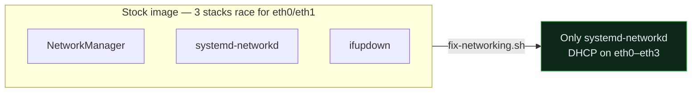

# Known Issues & Fixes

Two categories: **driver bugs** the vendor shipped, and **insecure defaults** in the
stock Ubuntu image. Everything here was observed on real hardware or taken from the
official release note; fixes are scripted where possible.

## Vendor driver bugs (from the official release note)

The Seeed `ubuntu20.04-v0.0.1` release note (2023-02-06) lists these as known at
launch. See [os-images/ubuntu-20.04-vendor-release-note.md](os-images/ubuntu-20.04-vendor-release-note.md).

| # | Component | Symptom | Status / workaround |
|---|-----------|---------|---------------------|
| 1 | **MT7921 / "M7921E" Wi-Fi** | Wi-Fi may not come up | Vendor driver issue. Wired is reliable; a newer kernel/`linux-firmware` may help. *(collecting community fixes — PRs welcome)* |
| 2 | **RTL8125B 2.5 GbE (`eth2`, `eth3`)** | The two 2.5 G ports may not link | Known vendor bug; `eth0`/`eth1` work. Often improved by an up-to-date `r8125` driver. |
| 3 | **Front-panel LED** | LED not controllable | Cosmetic; no functional impact. |

## "No DHCP" out of the box

**Not a NIC fault** — the image enables **three network stacks at once** (netplan/
systemd-networkd, NetworkManager, and ifupdown). They race for `eth0`/`eth1` and the
box often ends up with no address.

**Fix:** `scripts/fix-networking.sh` — standardizes on systemd-networkd, masks
NetworkManager, sets DHCP on `eth0`–`eth3`. After it, the unit pulls DHCP immediately.



## Insecure defaults (verified on a live unit)

The stock image is wide open on the LAN. `scripts/harden.sh` remediates the first three.

| Issue | Detail | Fix |
|-------|--------|-----|
| **Unauthenticated ADB** | `adbd` listens on `0.0.0.0:5555` — network ADB is a root shell to anyone on the LAN | `harden.sh` disables adbd |
| **Cleartext FTP** | `vsftpd` enabled on `:21` | `harden.sh` disables it (use SFTP over SSH) |
| **No firewall** | `iptables` all-ACCEPT, no rules | `harden.sh` installs `ufw`, default-deny inbound + allow SSH |
| **Shared SSH host keys** | Host keys are **baked into the image** (Oct 2022) — every flashed unit shares them, enabling MITM | Regenerate on first boot: `sudo rm /etc/ssh/ssh_host_* && sudo dpkg-reconfigure openssh-server` |
| **Default passwords** | `root` and `linkstar` use vendor defaults (same salt across units) | Change them; move to SSH key auth (`harden.sh --pubkey-file …`) |
| **SSH password auth on** | `PasswordAuthentication` defaults to yes | `harden.sh` disables it *once a key is installed* |

## First-boot `apt` lock trap

On first boot, `unattended-upgrades` runs and can **hang on the Ubuntu ESM check
while holding the dpkg lock** — manual `apt` then fails with `Could not get lock`.
The auto-update services also respawn to re-grab the lock.

**Fix** (nothing is mid-transaction, so it's safe):

```bash
sudo systemctl mask unattended-upgrades apt-daily.service apt-daily-upgrade.service \
                     apt-daily.timer apt-daily-upgrade.timer
sudo pkill -9 unattended-upgr
sudo dpkg --configure -a && sudo apt-get -f -y install
sudo dpkg --audit          # empty output = clean
```

Then update with `sudo apt-get -y -o Dpkg::Options::=--force-confold full-upgrade`.

> [!NOTE]
> The vendor **kernel lives in the `boot.img` partition, not an apt `linux-image`
> package**, so a full `apt` upgrade does **not** replace it — the upgrade is safe
> and won't break the board's specific 4.19 BSP kernel.

## Ubuntu 20.04 is past standard support

Standard support ended **April 2025**. Options: enable **Ubuntu Pro** (free ESM for
personal use) for continued security patches, or track the OpenWRT image (planned
v0.2.0). A full `apt` upgrade still applies all currently-available updates.
