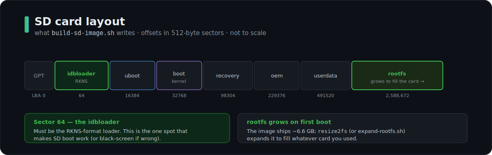

# Storage

<sub>[Home](../README.md) › [Docs](README.md) › Storage</sub>

The H68K has **two independent storage devices**, and understanding the split is the
key to flashing it safely.

| Device | Linux node | Size | Holds |
|--------|-----------|------|-------|
| **eMMC** | `mmcblk0` | ~32 GB (reported 29.1 GiB) | the factory Android-lineage vendor partitions |
| **microSD** | `mmcblk1` | your card | the OS you flash (Ubuntu root on `mmcblk1p8`) |

There is **no NVMe** — the single M.2 slot is used for the optional Wi-Fi module
(PCIe), not storage.

## Boot order: microSD first

The RK3568 bootROM checks the **microSD before the eMMC**. That's what makes the
[SD-from-a-Mac path](flash-ubuntu-sd-from-mac.md) work and non-destructive:

- **Card inserted** → boots your SD OS; the factory eMMC is left completely untouched.
- **Card removed** → falls back to whatever is on eMMC.

So a microSD is a zero-risk way to try an OS: pull the card and you're back to stock.

## Partition layout (SD)

`build-sd-image.sh` lays the vendor layout onto the card — the RKNS idbloader at
sector 64, then U-Boot, kernel, and a rootfs that grows to fill the card:

<p align="center">
  
</p>

Full detail: [how-it-works.md](how-it-works.md).

## Expanding the rootfs

The vendor image ships a ~6.6 GB rootfs regardless of card size. The stock image
auto-expands on first boot, but if it doesn't (or you `dd` a raw image onto a bigger
card), grow it yourself:

```bash
sudo scripts/expand-rootfs.sh        # partition grow (if needed) + online resize2fs
# or the one-liner:
sudo resize2fs "$(findmnt -no SOURCE /)"
```

`ext4` grows **online** — no unmount or reboot needed. (Verified on a live unit:
6.4 G → 114 G on a 128 GB card.)

## Card recommendations

- Use a **quality UHS-I (or better) microSD**, 8 GB minimum, 32 GB+ recommended.
- Fast cards matter — the rootfs is the working disk, not just boot media. A slow card
  makes the whole box feel slow.
- Cheap/counterfeit cards are the most common cause of "boots sometimes / corrupts."

## eMMC vs microSD — when to use which

- **microSD** — trying an OS, dual-booting different OSes by swapping cards, keeping the
  factory image safe. Reversible: pull the card.
- **eMMC** — a permanent, card-free install or a factory restore. Requires flashing over
  USB: see [flash-emmc-windows.md](flash-emmc-windows.md).

## Backing up before risky changes

Because it boots from a card, the simplest rollback is a **full SD image**:

```bash
# macOS (rdiskN is faster); Linux: /dev/sdX + status=progress
sudo dd if=/dev/rdiskN of=h68k-backup.img bs=4m
```

Re-flash that image to restore the exact state. This is the recommended safety net
before a distro upgrade or any eMMC work.
